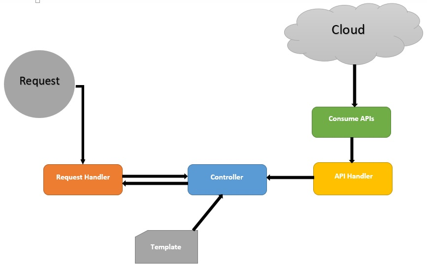

# ConsumeRestfulApis

Use case - list items, show detail of an item, edit item and user could delete item. This web app module consumes RESTful APIs and collects JSON to read it for analyze of the response. In the root of app, created .htaccess file that redirects all requests to a request handler - index.php. In request handler created routing switch based on request URI. Created an API handler that handles all consume api call.
Used MVC architecture to separate three layers.  

# Built

App is built on core PHP 7.2.5, no data base and no any third party tools has been used.

# Architecture

